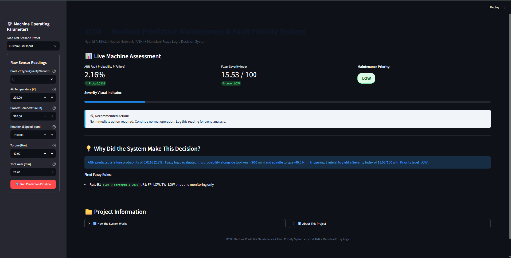
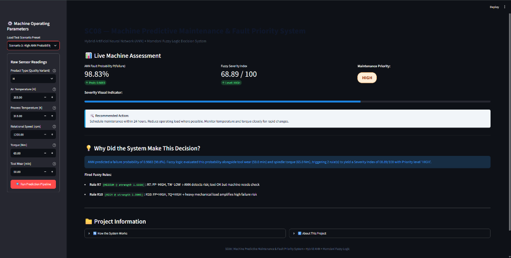
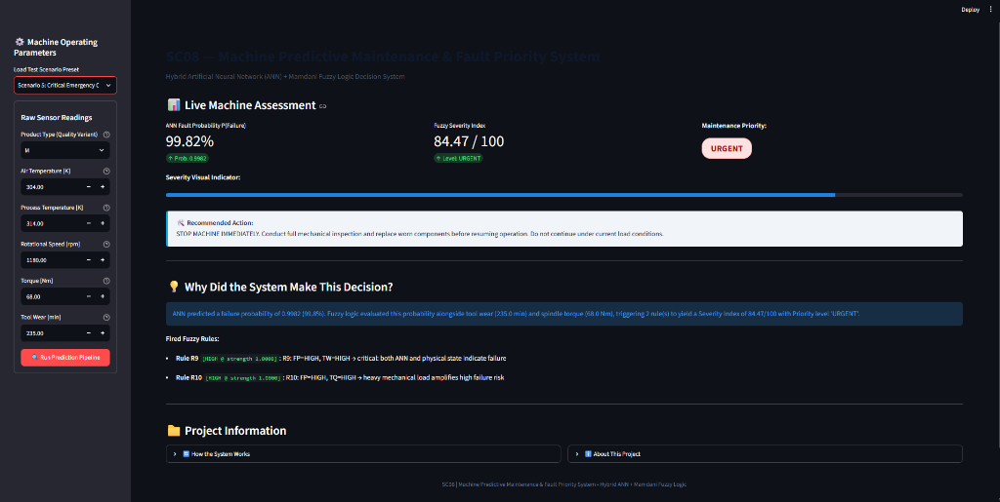

# SC08 — Machine Predictive Maintenance & Fault Priority System

## 1. Project Overview

This project implements an end-to-end data-driven machine predictive maintenance system developed for a university Soft Computing course (Project Code: SC08). The system processes raw machine operating parameters, evaluates failure risk using a hand-coded Artificial Neural Network (ANN), and reasons about physical degradation parameters using a hand-coded Mamdani Fuzzy Logic inference engine to compute a continuous Severity Index and assign actionable Maintenance Priorities (`LOW`, `MEDIUM`, `HIGH`, `URGENT`).

### Purpose of Combining ANN + Fuzzy Logic

- **ANN Strengths & Limitations:** The Artificial Neural Network excels at learning complex, non-linear relationships across multi-dimensional sensor data to estimate a continuous failure probability $P(\text{Failure}) \in [0, 1]$. However, raw probabilities lack operational context and domain-level explainability.
- **Fuzzy Logic Role:** The Mamdani Fuzzy Logic system incorporates domain rules and physical degradation indicators (such as tool wear and spindle torque) alongside the ANN probability score. This converts quantitative probability outputs into transparent, risk-aware severity scores, human-interpretable rule activations, and operational maintenance priorities.

---

## 2. Problem Statement

Traditional industrial maintenance strategies typically depend on fixed time-based schedules (preventive maintenance) or waiting until component failure occurs (breakdown maintenance). Fixed schedules can lead to unnecessary servicing of operational machinery and higher maintenance overhead, while breakdown maintenance results in unplanned downtime, production loss, and catastrophic failure risks.

This project demonstrates a data-driven system that estimates machine failure risk and converts predictions into interpretable, risk-aware maintenance priorities to support operational decision-making.

---

## 3. Project Objectives

- Predict machine failure probability from operational parameters.
- Use machine operating parameters as model inputs.
- Implement an Artificial Neural Network from scratch using NumPy.
- Implement a Mamdani Fuzzy Logic system from scratch using NumPy.
- Produce an interpretable severity score ($0\text{--}100$).
- Convert severity into discrete `LOW`, `MEDIUM`, `HIGH`, and `URGENT` priority levels.
- Provide contextual maintenance recommendations based on rule firing.
- Demonstrate the complete decision pipeline through an interactive Streamlit dashboard.

---

## 4. Dataset

The project utilizes the **UCI AI4I 2020 Predictive Maintenance Dataset** (UCI Repository ID 601).

- **Total Records:** 10,000 synthetic operational records reflecting real milling machine operation.
- **Target Variable:** `Machine failure` (binary label: $0 = \text{healthy}$, $1 = \text{failure}$).
- **Class Imbalance:** Highly imbalanced failure rate (~3.39% positive class across the dataset).
- **Sub-failure Modes:** The dataset includes 5 individual failure mode columns (`TWF`, `HDF`, `PWF`, `OSF`, `RNF`), which represent component breakdowns but are excluded from ANN training to prevent data leakage.
- **Dataset Property Note:** The AI4I 2020 dataset does **not** contain a vibration sensor. Spindle load is represented by `Torque [Nm]`.

---

## 5. Input Features

### ANN Input Features (7 Features)

The ANN processes seven preprocessed input features in exact canonical order:

1. `Air temperature [K]`
2. `Process temperature [K]`
3. `Rotational speed [rpm]`
4. `Torque [Nm]`
5. `Tool wear [min]`
6. `Type_M` (One-hot encoded flag for Medium quality variant)
7. `Type_H` (One-hot encoded flag for High quality variant)

*(Note: Product Type `L` serves as the reference category when `Type_M = 0` and `Type_H = 0`)*

### Dashboard Machine Parameters

The Streamlit user interface collects six raw operational parameters from the user:

- **Product Type:** Quality variant selector (`L`, `M`, or `H`)
- **Air Temperature:** Ambient operating temperature in Kelvin [K]
- **Process Temperature:** Machine operational temperature in Kelvin [K]
- **Rotational Speed:** Spindle speed in revolutions per minute [rpm]
- **Torque:** Spindle torque in Newton-metres [Nm]
- **Tool Wear:** Cumulative tool operating time in minutes [min]

---

## 6. System Architecture

The project pipeline executes sequentially from raw input parameters to priority assignment:

```
Machine Sensor Data
        ↓
Preprocessing
        ↓
Min-Max Normalisation
        ↓
ANN
7 → 16 → 8 → 1
        ↓
Failure Probability
        ↓
Mamdani Fuzzy Logic
        ↓
Defuzzification
Centre of Gravity
        ↓
Severity Index (0–100)
        ↓
Maintenance Priority
LOW / MEDIUM / HIGH / URGENT
```

---

## 7. Artificial Neural Network

- **Implementation:** Built entirely from scratch using **NumPy** (without PyTorch, TensorFlow, Keras, or scikit-learn neural network modules).
- **Architecture ($7 \rightarrow 16 \rightarrow 8 \rightarrow 1$):**
  - **Input Layer:** 7 features (scaled numeric features + one-hot product types).
  - **Hidden Layer 1:** 16 hidden units with ReLU activation ($f(z) = \max(0, z)$).
  - **Hidden Layer 2:** 8 hidden units with ReLU activation.
  - **Output Layer:** 1 output unit with Sigmoid activation ($\sigma(z) = \frac{1}{1 + e^{-z}}$), returning $P(\text{Failure}) \in [0, 1]$.
- **Weight Initialization:** He (Kaiming) normal initialization for ReLU layers; Glorot/Xavier normal initialization for the Sigmoid output layer.
- **Loss Function:** Class-weighted Binary Cross-Entropy (BCE) loss ($w_{\text{pos}} \approx 28.52$) to penalize missed positive failure instances without artificial oversampling.
- **Training & Validation Protocol:**
  - 80/20 stratified split into training (8,000 samples) and test (2,000 samples) sets.
  - Training set further split 90/10 for validation (7,200 train / 800 val).
  - Optimized via mini-batch Stochastic Gradient Descent (SGD) with early stopping (patience = 15 epochs based on validation loss).
  - The 2,000-sample test set remained strictly untouched until final evaluation.

---

## 8. Fuzzy Logic System

- **Implementation:** Hand-coded Mamdani Fuzzy Inference System built using **NumPy** (without `scikit-fuzzy`).
- **Input Variables (3 Inputs):**
  1. `ANN Fault Probability` (`fault_prob` $\in [0.0, 1.0]$): MFs = `LOW`, `MEDIUM`, `HIGH`
  2. `Tool Wear` (`tool_wear` $\in [0, 260]$ min): MFs = `LOW`, `MEDIUM`, `HIGH`
  3. `Torque` (`torque` $\in [0, 80]$ Nm): MFs = `LOW`, `MEDIUM`, `HIGH`
- **Output Variable (1 Output):**
  - `Severity Index` ($\in [0, 100]$): MFs = `LOW`, `MEDIUM`, `HIGH`
- **Membership Functions:** Triangular and trapezoidal shapes evaluated across a 1,000-point discrete universe vector.
- **Fuzzy Rule Base (11 Rules):**
  - **Primary Rules (R1–R9):** $3 \times 3$ decision matrix crossing ANN Fault Probability and Tool Wear.
  - **Supplementary Torque Rules (R10–R11):** Account for heavy spindle torque amplifying failure risk.
- **Inference & Defuzzification:**
  - Mamdani inference engine (min for AND antecedent evaluation, max for rule aggregation).
  - Centre of Gravity (CoG / Centroid) defuzzification method over 1,000 discrete points.
- **Maintenance Priority Thresholds:**
  - `LOW`: Severity Index $< 33.0$ (routine monitoring)
  - `MEDIUM`: $33.0 \le$ Severity Index $< 60.0$ (plan maintenance soon)
  - `HIGH`: $60.0 \le$ Severity Index $< 78.0$ (schedule maintenance within 24 hours)
  - `URGENT`: Severity Index $\ge 78.0$ (stop machine immediately)

---

## 9. Decision Pipeline

### Behavioral Example

Consider a machine producing a high ANN failure probability ($P(\text{Failure}) = 98.83\%$). If physical indicators such as tool wear ($50\text{ min}$) and torque ($65\text{ Nm}$) are also elevated, fuzzy rules R7 and R10 trigger, resulting in a defuzzified Severity Index of $68.89/100$ and assigning a **HIGH** maintenance priority. If physical tool wear is also critical ($235\text{ min}$), rule R9 triggers to escalate the output to an **URGENT** priority ($84.47/100$).

*Note: This demonstrates system decision-making behavior under compounding risk conditions. A high ANN probability alone does not automatically guarantee an URGENT priority; if physical tool wear and torque are low, the fuzzy system adjusts the severity downward (e.g. to a MEDIUM level via Rule R7).*

---

## 10. Streamlit Dashboard

The project includes an interactive web dashboard built with Streamlit (`app/app.py`):

- **Machine Parameter Inputs:** Sidebar controls to specify Product Type, Air Temperature, Process Temperature, Rotational Speed, Torque, and Tool Wear.
- **Preset Test Scenarios:** Pre-loaded operational test scenarios for quick evaluation.
- **Real-Time Pipeline Execution:** Displays ANN Fault Probability ($P(\text{Failure}) \%$).
- **Severity & Priority Indicators:** Displays the Fuzzy Severity Index ($0\text{--}100$), a progress visualization bar, and a color-coded priority badge (`LOW`, `MEDIUM`, `HIGH`, `URGENT`).
- **Recommended Maintenance Action:** Context-aware operational recommendations.
- **Fuzzy Explainability:** Detailed view of fired fuzzy rules, individual rule activation strengths, and human-readable reasoning.
- **System Architecture Guide:** Informational modal explaining the hybrid decision process.
- **Execution:** Runs locally via Streamlit.

---

## 11. Verified Benchmark Scenarios

The system has been evaluated against verified benchmark scenarios:

| Scenario | ANN Fault Probability | Severity Index | Priority |
|---|---:|---:|---|
| Normal Machine | 2.16% | 15.53/100 | LOW |
| High ANN Risk | 98.83% | 68.89/100 | HIGH |
| Critical Machine | 99.82% | 84.47/100 | URGENT |

The repository contains five built-in benchmark test scenarios (`run_pipeline_tests()` in `src/prediction.py`), and the automated verification reported:

`ALL 5 SCENARIO TESTS PASSED`

---

## 12. Threshold Analysis

A decision threshold analysis was conducted on the 800-sample validation set while the 2,000-sample test set remained untouched:

- **Default Threshold:** The system maintains a default decision threshold of $\tau = 0.50$.
- **Validation Observations:** Candidate threshold evaluation ($0.10$ to $0.90$) showed that $\tau = 0.90$ achieved the highest $F_1$-score ($0.6207$, Precision: $0.5806$, Recall: $0.6667$) on the validation split.
- **Scope Note:** This observation is split-specific and is **not** claimed to be universally optimal.
- **Operational Trade-off:** Optimal threshold selection in industrial deployment depends on plant-specific costs balancing false alarms against undetected machine breakdowns.

---

## 13. Testing & Validation

Testing and verification scripts included in the repository:

- `python -m src.prediction`: Runs 5 end-to-end operational pipeline scenario tests.
- `python -m src.evaluation`: Evaluates ANN, Baseline logistic regression, and Hybrid Fuzzy pipeline metrics on the 2,000-sample test set (`results/metrics.json`).
- `python -m src.threshold_decision`: Performs threshold grid analysis across validation samples (`results/threshold_decision_analysis.json`).

### Verified Test Set Metrics (2,000 Samples)

- **ANN ROC-AUC:** `0.9581`
- **ANN Recall at $\tau=0.50$:** `0.9118` (62 of 68 true failure instances detected)
- **Baseline ROC-AUC:** `0.9281`
- **Scenario Tests:** All 5 pipeline test assertions passed successfully. No claims of "100% accuracy" are made.

---

## 14. Project Structure

```
SC08-Predictive-Maintenance/
├── app/
│   └── app.py
├── data/
│   ├── ai4i2020.csv
│   ├── README.md
│   └── processed/
│       ├── norm_params.json
│       ├── X_test.npy
│       ├── X_train.npy
│       ├── y_test.npy
│       └── y_train.npy
├── report/
├── results/
│   ├── figures/
│   │   ├── ann_learning_curve.svg
│   │   ├── ann_vs_baseline_metrics.png
│   │   ├── confusion_matrices.png
│   │   ├── hybrid_priority_distribution.png
│   │   ├── threshold_decision_analysis.png
│   │   └── validation_threshold_analysis.png
│   ├── ann_weights.npz
│   ├── metrics.json
│   ├── threshold_decision_analysis.json
│   └── training_history.json
├── screenshots/
│   ├── dashboard-normal-low.png
│   ├── dashboard-high-risk.png
│   └── dashboard-critical-urgent.png
├── src/
│   ├── __init__.py
│   ├── ann.py
│   ├── baseline.py
│   ├── evaluation.py
│   ├── fuzzy.py
│   ├── prediction.py
│   ├── preprocessing.py
│   ├── threshold_analysis.py
│   └── threshold_decision.py
├── .gitignore
├── README.md
└── requirements.txt
```

---

## 15. Installation

### 1. Clone Repository & Navigate

```bash
git clone <repository-url>
cd SC08-Predictive-Maintenance
```

### 2. Create & Activate Virtual Environment

**Windows:**
```powershell
python -m venv .venv
.venv\Scripts\activate
```

**Linux / macOS:**
```bash
python3 -m venv .venv
source .venv/bin/activate
```

### 3. Install Dependencies

```bash
pip install -r requirements.txt
```

---

## 16. Running the Project

### Launch Streamlit Dashboard

```bash
streamlit run app/app.py
```

### Run Automated Pipeline & Verification Tests

```bash
# Run 5 end-to-end scenario tests
python -m src.prediction

# Run test set evaluation (ANN, Baseline, Hybrid Fuzzy)
python -m src.evaluation

# Run threshold decision analysis on validation set
python -m src.threshold_decision

# Run data preprocessing pipeline
python -m src.preprocessing
```

---

## 17. Stage 1 Dashboard Screenshots

The following screenshots provide visual evidence of the working Stage 1 Streamlit dashboard interface evaluating machine risk across operational benchmark scenarios:

### Normal Machine — LOW


### High ANN Risk — HIGH


### Critical Machine — URGENT


---

## 18. Limitations

- Model evaluation and validation results depend on the selected train/validation split and historical dataset distribution.
- Decision threshold selection depends on plant-specific maintenance cost structures and operational requirements.
- The project is a university prototype system developed for academic evaluation.
- Industrial deployment would require additional testing, hardware integration, and validation within an active plant environment.

---

## 19. Future Scope

- Integration of larger, multi-machine real-world industrial sensor datasets.
- Extended evaluation across additional failure modes and machinery types.
- Exploration of hyperparameter tuning and model optimization algorithms.
- Deployment to cloud or edge computing infrastructure.
- Real-time stream integration with industrial IoT sensors and SCADA systems.

---

## 20. Technologies Used

- **Python ($\ge 3.9$):** Primary programming language.
- **NumPy ($1.24 \le \text{version} < 2.0$):** Hand-coded ANN linear algebra, Mamdani Fuzzy logic inferencing, defuzzification, and matrix operations.
- **Pandas ($2.0 \le \text{version} < 3.0$):** Data manipulation and CSV loading.
- **Matplotlib ($3.7 \le \text{version} < 4.0$):** Performance curve plotting and confusion matrix visualization.
- **Streamlit ($1.35 \le \text{version} < 2.0$):** Web dashboard user interface.
- **Git / GitHub:** Version control and source code repository.

---

## 21. Academic Context

- **Course:** Soft Computing
- **Project Code:** SC08
- **Purpose:** University Project / Stage 1 Documentation
